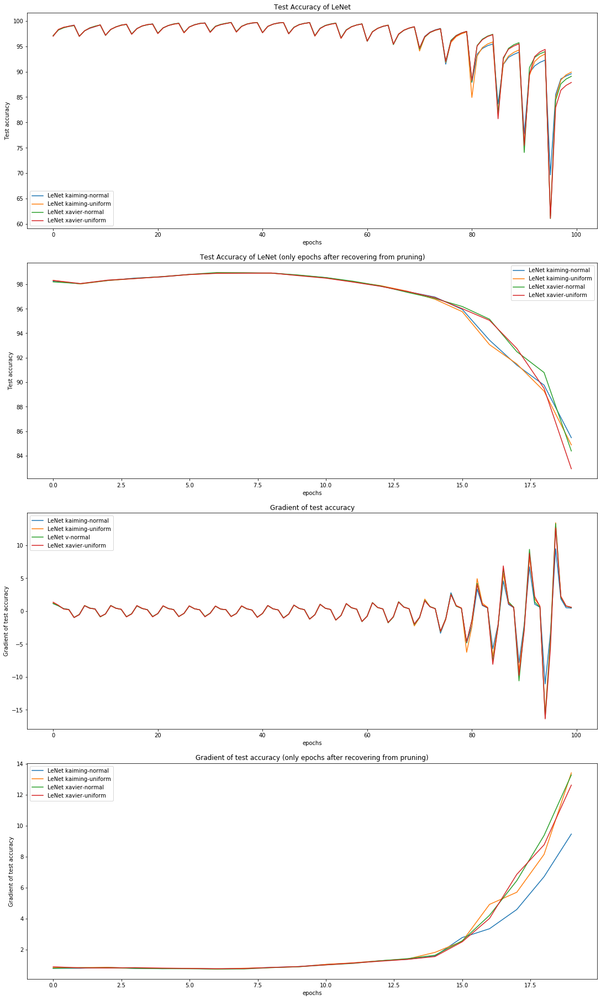
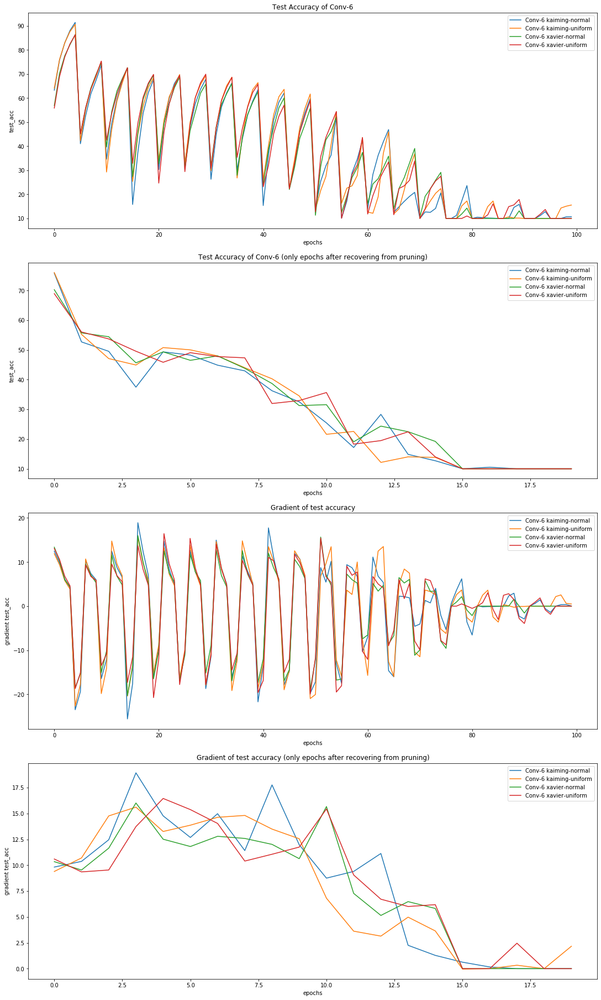
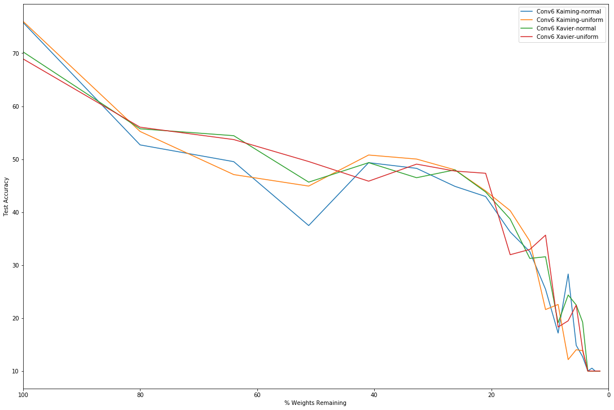
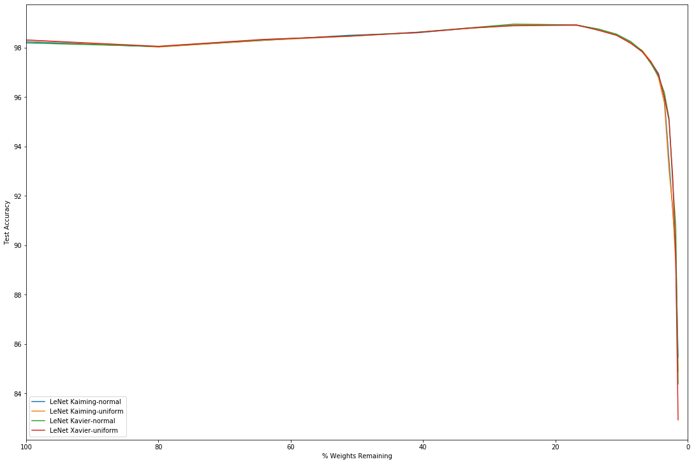

## Problem Statement

Having neural networks trained to carry out tasks like object detection or shape recognition can be very useful in everyday life, like for face recognition or self-driving cars. But getting a high performance on these tasks typically comes with a pretty high price. High performance often requires a high number of parameters within the neural network, and a high number of parameters demands great computational and memory resources.

For big companies getting these resources is not that much of a problem, but for researchers and developers these are generally not readily available. For this last group, it is important to find effective ways to reduce the amount of computation needed for their neural network whilst still maintaining a high performance. A very promising method to do so is called pruning.

Quite recently, research showed that big neural networks are made up of sub-networks that seem to have high degrees of sparsity. This means that these sub-networks contain certain connections in their network that are insignificant in the broad view of the neural network. [1,3] Pruning is a way to reduce the size of the neural network by removing these non-essential weights. Pruned networks have been shown to be trained to equal or better accuracy than an unpruned network, in the same amount of steps.

To make sure the neural network works and no outputs will be lost, neural networks follow a certain initialisation schema when it comes to initialising weights. Pruning has effect on these initialisations, like explained briefly before, meaning it leaves out the 'less important' weights in such an initialisation. This poses the next interesting question: What is the effect of using different initialisation schemas on the neural network's robustness to pruning, meaning the trade-off between accuracy and sparsity level?

So the purpose of this project is finding out how different initialisation schemas respond to pruning, if there are dissimilarities in the accuracy and sparsity levels between the different schemas. In this project, the initialisation schemas used are the Xavier normal and uniform distribution, and the Kaimin normal and uniform distribution. Both schemas will be used in training a feedforward neural network and a convolutional neural network. And as for the pruning, here magnitude based pruning with resetting will be implemented.

Results of the question above will afterwards be used to study whether or not it is possible to construct a custom initialisation schema that will improve robustness even further and if this will work as well for other pruning methods. If so, using that schema with pruning could prove to be even more beneficial for training neural networks.

## Datasets Used

The first dataset used for this project is the Modified National Institute of Standards and Technology database, MNIST (LeCun, Cortes & Burges, ,,,). The MNIST database is a large database containing labelled images of handwritten digits, so the digit written in the image corresponds with the label of said image. The data contains 60.000 examples in its training set and 10.000 examples in its test set. The data is as mentioned already labelled and immediately usable, it did not need cleaning. For an example of the data, see fig...

The second dataset used in this project is Canadian Institute For Advanced Research-10, CIFAR-10 (Krizhevsky, Nair & Hinton, …). The dataset consists of 60.000 colour images, spread out evenly over 10 classes. The dataset is divided into five training sets and one test set, all containing 10.000 images. The dataset is, just like MNIST, already labelled with the classes corresponding with what is to be seen on the image, and did not need any cleaning either. For an example of the data, see fig…

## Theoretic Definitions

### Neural Networks
A neural network is a technological system that functions similarly to the neurons of the human brain. Neural networks are used in Artificial Intelligence for for example deep learning and machine learning. The systems are designed to function like the human brain, replicating the way humans learn. The basic of the system contains an input layer, an output layer, and hidden layers in between that change the input layer so that the output layer produces useful values. All layers consist of a certain amount of nodes, which all have their share in information. The network is trained to find patterns in data, and to recognize said patterns in new data. An example for use of neural networks is the recognition of numbers or pictures, like the for the datasets used in this project.
The way a neural network learns the patterns in data, is by 'weights' used to calculate the value for a new node in the next layer. So when data is given to the input layer, the input is manipulated by the corresponding weights, which will give the input for the next layer. This process is repeated untill the the output layer is reached. Training a neural network takes a training dataset, which the network can use to learn the correct weights in between all the layers. When trained, the network can be used on other data of the same format for for example classification of images.

The types of neural networks used in this project are the feedforward neural network and the convolutional neural network. The feedforward neural network is a network where the information that travels through the network only travels in one direction: from the input layer to the output layer via potential hidden layers.

*insert figure of ff nn*

A convolutional neural network is a little more complicated. Whereas in a feedforward neural network all nodes are connected to all the nodes in the previous layer, for a convolutional network the nodes are only connected to other nodes located close to itself. A convolutional network is used when it is useful to preserve the spatiality of the input data. The important layers in a convolutional network are the convolution layer, the ReLU layer, the pooling layer and the classification layer

Convolution - The convolutional layer, where the network gets its name from, extracts features from input data. It maintains spatiality of the data by learning the features in forms of small squares, or feature maps. 

*insert picture of a convolved feature*

ReLU - The Rectified Linear Unit layer is a non-linear operation. What ReLU does, is it replaces all the negative values in the feature map by zero. Because it is a non-linear operation, it makes sure the spatiality is preserved. 

*insert figure of ReLU*

Pooling - In this project, max pooling is used. What max pooling does, is it moves a square of a certain size over the feature map, obtained after convolution and ReLU, and takes the largest element of that region and saves it in a square of the same size. Another way of pooling is average pooling, where instead of the largest value of the square, the average is calculated and saved in the new square. 

*insert photo of max pooling*

Classification - The classification of data is done via a fully connected layer, meaning all nodes are connected to every node in the previous layer, like the feedforward neural network. It uses the features from the previous layers to classify an image into various classes based on a training dataset. 

### Pruning
Pruning is a way to get a faster/smaller neural network. It is usefull for researchers and developers that do not posses the resources to process the data with big networks. In short, what pruning does, is it ranks the weights of nodes and removes the most unimportant weights from the neural network. In this project magnitude based pruning is used, with resetting. This means the significance of a weight is determined by its absolute size. After the non-essential weights are removed, the remaining weights are reset to their initial value. The advantages of pruning are that it generelises results better, improves the calculation speed of the network and makes for a smaller network as well. 

*insert other types of pruning?*

### Initialisation schemas
When building a neural network, the weights of the network have to be given a value. This is usually done with an initialisation schema to prevent the output from vanishing or exploding. 

In this project, the Xavier and the Kaiming initialisations are used. The Xavier initialisations sets a layer's weights to values randomly selected out of the distribution bound between 

*insert xavier formula*

The Kaiming initialisaion chooses a weights value from an already familiar function, the ReLU. The values from the weights are then either 0 or a positive number, smaller than 1. 

*insert picture of kaiming* 

For both initialisation schemas, a uniform distrubtion and a normal distribution are used to set the weights. A uniform distribution is a distribution where all values are equally likely to be chosen, so with a range from 0 to 10, all values between 0 and 1 have 10% chance to be picked, same as all values betwee 5 and 6. A normal distribution works differently, namely the chance to get a value near the mean is higher than getting a value on one of the edges. For example, with a range from 0 to 10 and mean 5, the chances of getting a value between 5 and 6 are higher than the chance of getting a value between 0 and 1.

### Trade off sparsity and accuracy
Two key words in this project are sparsity and accuracy. Sparsity is a measure of how many values in a certain weights group are 0. So, the higher the sparsity, the lower the amount of weights remaining. A high level of sparsity results in a smaller and faster neural network. But this might be at the cost of the accuracy of the neural network. The accuracy of a neural network is a measure of how well the network performs on given data after training. The higher the accuracy, the better the network perform its task, in this case, the better it recognizes written digits or pictures.

When implementing pruning, it is important to keep the trade-off between sparsity and accuracy in mind. It is advantagous to have a small and fast network, but it depending on the research it might be more important to keep a high accuracy. High sparsity can result in low accuracy, so it is essential to keep this balance in mind when doing research.

### Seeds
	In general

### Pytorch
	In general

### Tensorboard
	In general

## Approach / Method

-possible approaches and actual approach with motivation
-of misschien achteraf dus andere methoden geven

There were two types of neural networks build for this project, a feedforward neural network and a convolutional neural network. These networks were chosen from the 6 neural networks used in Frankle and Carbin, 2019. Both networks were created using pytorch in github. The feedforward neural network was trained on the MNIST dataset, and the convolutional network was trained on the CIFAR-10 dataset. In both of the networks a pruning mechanism was implemented. The pruning mechanism used is magnitude based pruning with resetting.

*insert table with specs of the networks*

In order to answer the question central to this project, it is necessary to experiment and train the neural networks with different initialisation schemas. The schemas used are the Kaiming and the Xavier schemas. Both come in two variations in pytorch, namely, distributed and normalized.

To find out how different initialisation schemas respond to pruning, both neural networks will run 3-5 times with both initialisation schemas. These experiments will have to run with the seed to filter out a certain randomness in the results (little more explanation). But, to still get reliable results, 3 different seeds will be used so results can be compared and analysed. See fig. … for a visualised manner of the experiments.

*insert figure of visualisation of experimenting via graphviz*

When all experiments are completed, the results will be analysed to see whether or not the initialisation schema has responded to the pruning. Focus will be on finding dissimilarities in the trade off of accuracy and sparsity between the different schemas. It will be determined which schema works best for which network and why that is the case. (sparsity levels?)

After all this is done, the results will be studied to see if there is a possible custom initialisation schema that will improve performance even further and if it is possible for that schema to work as well for other pruning methods.

In short, the steps taken in this project are as follows:

1. Implement a feedforward neural network and train it on the MNIST dataset.

2. Implement a convolutional neural network and train it on the CIFAR10 dataset.

3. Implement the pruning mechanism. Magnitude based pruning with resetting will suffice.

4. Experiment with different initialization schemas built-in into PyTorch. The question we are trying to answer is: Does the initialization schema of a network affect its robustness to pruning? Note that since initializations are sampled from probability distributions, multiple runs with different seeds are required.

5. Determine, for both of the above networks, and at varying degrees of sparsity levels, which schema works best and why.

6. Based on the above results, is it possible, then, to construct a custom initialization schema that improves the robustness further?

7. Check whether the schema built on (6) generalizes to other pruning methods.

## Results

In order to analyse potential differences between initialisation methods with respect to their effect on the robustness to pruning of the resulting trained networks, we plotted the test accuracies of the neural networks initialised by each of the four initialisation methods studied in this project. This is done for both LeNet and Conv-6. To mitigate erratic results inherent to initialisation based on random sampling, all experiments have been repeated several times using different seeds. The plots show the average of the experiments over all the seeds.

When comparing the test accuracies the LeNet networks is becomes clear that all initialisation methods perform very similarly, with differences becoming more pronounced around the 80th training epoch. Since pruning occurs every 5th epoch, performance drops after every pruning iteration but quickly recovers after further training. This drop in test accuracy increases in magnitude increases with amount of iterations.

To smooth out the drops in performance caused by pruning, the same the results are filtered and only the epochs just before pruning are plotted. In these epochs, the network has recovered from loss in performance due to pruning by re-training and adjusting the remaining weights to compensate for this reorganisation. An important difference between the linear network and the convolutional network is that that LeNet is better than Conv-6 at recovering from the effect of pruning and recovers well even after the growing impact on performance with amount of steps. The test accuracy of the convolutional networks suffer greatly under the pruning of weights, with a comparable performance for all four initialisation methods.

To compare the performance of the initialisation methods under different sparsity levels the test accuracy has been plotted against the percentage of weights remaining. For LeNet, performance of all four initialisation methods is almost identical, with little variance under different sparsity levels. For Conv-6 the results are more varied between initliaisations, but none of the methods tested performs better consistently than any other.

Cleaned / labelled data
Procedure to construct prediction/clustering model
The findings
The evaluation to show: which one is the best for different measurements, or how the results can be different if given different parameters, or why your findings are the best
Possibly: What didn't work and why

Have two working models, and at least one pruning method implemented.
Have baselines implemented: models initialized via different schemes, no pruning performed
Experiment with various initialization schemes. Compare against each other and against the unpruned baseline in terms of performance/sparsity tradeoff.
Determine which initialization scheme(s) offer(s) the best accuracy-sparsity tradeoff and assert why.
Present results via a powerpoint.

## Conclusion
Usability / constraints of solution
Generalizability of solution
Possible improvements

## REQUIREMENTS

## GENERAL
In English
Refer the criteria for report
Use checklist for more detailed rules

## CHECKLIST
All sections

Provide clear structure, one subject per section, clear storyline to solution

Use literature and references

Table and Graph

give all tables and figures numbers and a name

make sure text refers to tables and figures, discuss tables with results; explain what can be seen

for graphs, make sure what the axes are and what lines mean etc

Use spell checker

No ´colloquial' language

Avoid recording program code in raw form in text, use pseudocode or friendly format, important code 
or data in appendix

Use formulas only when needed and explain well

For operating different readers, use extra sections to 'explain' e.g. neural networks
