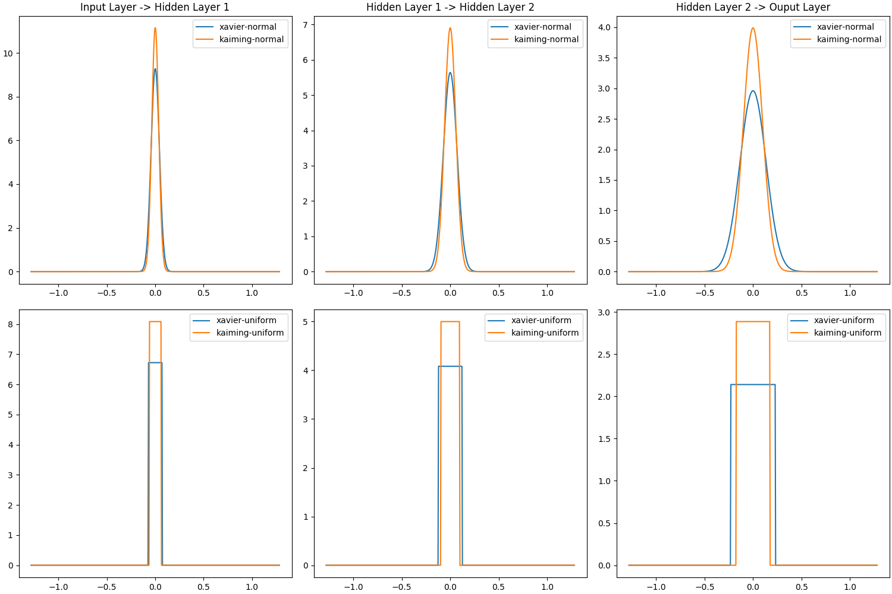

# Neural networks are very cool

* TODO: Images of cool applications.

# But they can be very demanding 

* TODO: Numbers for huge networks and how long it takes to train them.

---

__The Lottery Ticket Hypothesis__

A randomly initialized, dense neural-network contains a subnetwork that is
initalized such that -- when trained in isolation -- it can match the test
accuracy of the original network after training for at most the same number of
iterations.

[@frankle2019]

---

__The Lottery Ticket Hypothesis__ (redux)

A big net contains a small net that can match the big net.

---

# Finding winning tickets by pruning

* Pruning
* Magnitude-based pruning
* Iterative magnitude-based pruning

---

# Status quo on pruning

TODO

* [@frankle2019]
* [@morcos2019]

---

# Our question

\center
How do initialization algorithms compare when looking for winning tickets?

---

# Method
## Plan

1. Pick dataset.
2. Pick model.
3. Pick initialization methods.
4. __Write the code.__
5. __Do lots of experiments.__
6. Answer the question.

---

# Method
## Dataset: MNIST
\center
{ height=150px }

* Handwritten digits
* $28 \times 28$ pixels
* Training set: 60k
* Test set: 10k

---

# Method
## Model: LeNet [@lecun1998]
\center
{ height=150px }

* Fully connected
* Two hidden layers: 300 & 100 neurons $\rightarrow$ 266k weights.
* Leaky ReLU (negative slope: $0.05$)

---

# Method
## Initialization Methods

|                              |  | Xavier                                              | Kaiming                                    |
|------------------------------|--|-----------------------------------------------------|--------------------------------------------|
| $\mathcal{U}(-a, a)$         |  | $\sqrt{\frac{6}{\text{fan\_in} + \text{fan\_out}}}$ | $\sqrt{\frac{3}{\text{fan\_mode}}}$        |
| $\mathcal{N}(0, \text{var})$ |  | $\sqrt{\frac{2}{\text{fan\_in} + \text{fan\_out}}}$ | $\frac{\text{1}}{\sqrt{\text{fan\_mode}}}$ |

* `fan_in`/`fan_out`: number of inputs to/outputs from a neuron.
  `fan_mode`: `fan_in` or `fan_out`.

---

# Method

\center
Initialization Methods' Probability Density Functions

\center
{ width=95% }

---

# Method
## Training

1. Initialize network and save weights.
2. Train for 5 epochs.
3. Trim smallest 20% of the weights.
4. Reset the weights to the saved ones.
5. `GO TO 2`

\center
{ height=150px }

---

# Method
## Testing

* Save loss and accuracy on the training and testing set after every epoch.

\center
{ height=100px }

---

# Results

---

# Further Research

Get interns to try:

* Distributions that are even narrower around $0$.
* More datasets.
* More models.
* More pruning rates and pruning intervals.
* More pruning methods.

# Questions?
